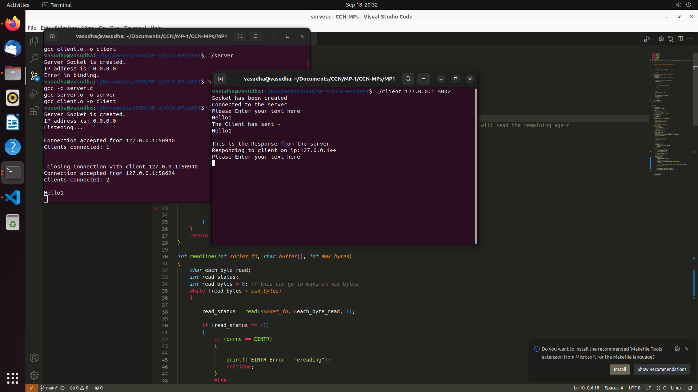
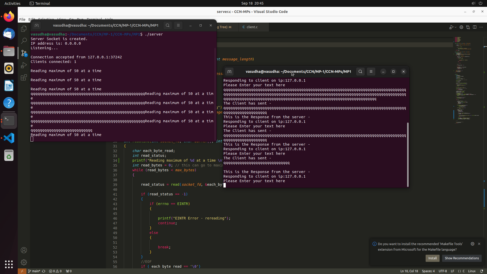
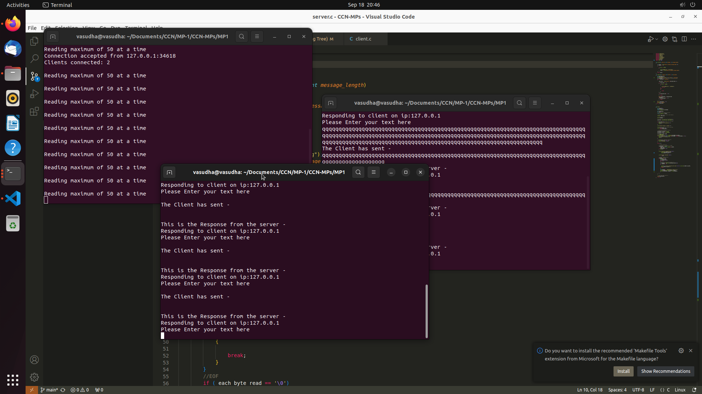
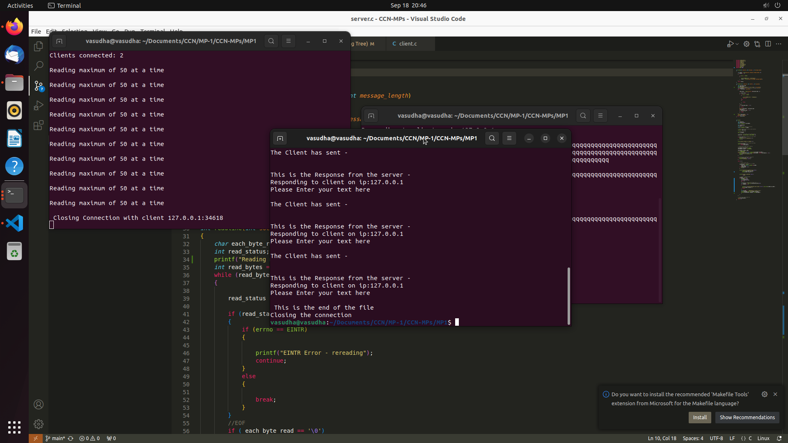
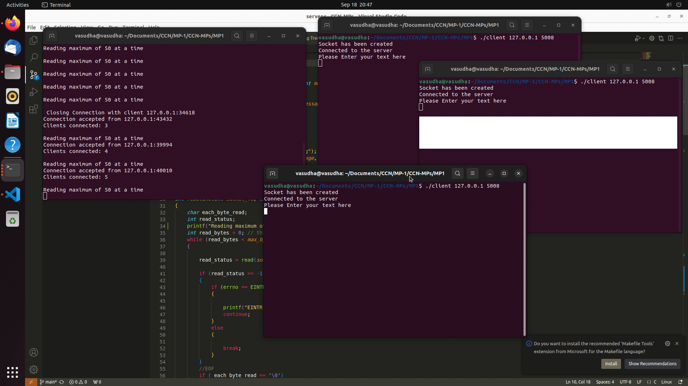

#### ECEN 602 - MP1 

Vasudha Devarakonda
Tushar Premanand

### distribution of work 

server.c -> Vasudha Devarakonda
client.c -> Tshar Premanand 

README -> Vasudha Devarakonda
ChatGPT-> Tushar Premanand 

### TCP Echo Server and Client

In this assignment, you will implement the client and server for a simple TCP echo service,
which does the following:
1. Start the server first with the command line: echos Port, where Port is the
port number on which the server is listening. The server must support multiple
simultaneous connections.
2. Start the client second with a command line: echo IPAdr Port, where IPAdr
is the IPv4 address of the server in dotted decimal notation and Port is the
port number on which the server is listening.
3. The client reads a line of text from its standard input and writes the line to the
network output to the server.
4. The sever reads the line from its network input and echoes the line back to
the client.
5. The client reads the echoed line and prints it on its standard input.
6. When the client reads an EOF from its standard input (e.g., terminal input of
Control-D), it closes the socket and exits. When the client closes the socket, the
server will receive a TCP FIN packet, and the server child process’ read()
command will return with a 0. The child process should then exit

### How to complie 

Run the following commands 
1. `make`
2. In different termianls `./server` and `./client`

Testing 

1. **line of text terminated by a newline** -> Client sends a message ans soon as it ends ENTER, server reads the message and responds 

2. **line of text the maximum line length without a newline** -> once the maximum bytes, i.e. 50 in this case, is reached the server divides the message to accommodate the message sent by the client

3. **line with no characters and EOF** -> when no character is sent the server does not read anything. `reading maximum 50 at a time ` *a log statement*

4. **client terminated after entering text** -> Ctrl+D makes client terminate and that log can be seen in server

5. **three clients connected to the server** -> screenshot below shows multiple clients connection with server

